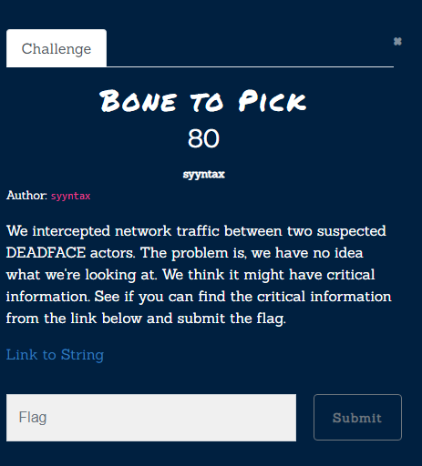
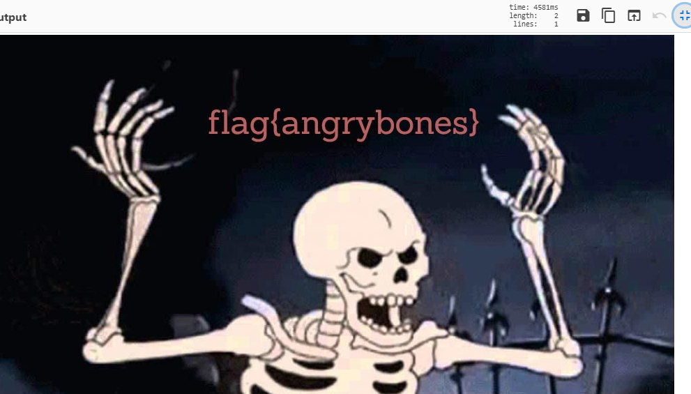

# Bone to Pick

[Link to String](https://pastebin.com/xL04idu2) 
If not available [Link to String](../../assets/cryptography/xL04idu2.txt)

If you copy the string into cyberChef's magic tool with the [this recipe](https://gchq.github.io/CyberChef/#recipe=Magic(6,true,false,''))
It suggests [this recipe](https://gchq.github.io/CyberChef/#recipe=From_Base64('A-Za-z0-9-_',true)Encode_text('UTF-8%20(65001)')Render_Image('Raw'))
and produces image with flag

Flag: `flag{angrybones}` 
