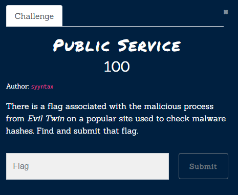
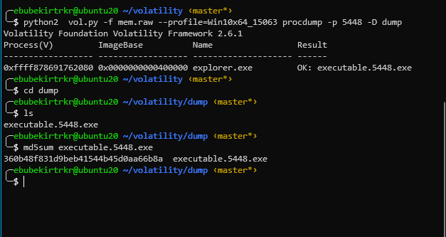

# Public Service


[Zip File](https://drive.google.com/file/d/1porBmluAvOp9qaK-lRJf4NqYysfd9gxw/view?usp=sharing) 
Please before look to [Evil Twin](Forensics/Evil%20Twin/index.md)
We need to dump the process with PID `5448`
```bash
	python2  vol.py -f mem.raw --profile=Win10x64_15063 procdump -p 5448 -D dump
```
It will produce an exe in dump folder. We calculate the md5 of file

If we search for the md5 hash in  the [viriustotal](virustotal.com)
we find the flag at [url](https://www.virustotal.com/gui/file/096740ce1bc9fa14ab07c16efd21fd946b7e966dbc1fe66ce02f5860911c865e/community)

Flag: `flag{h4cktober_ctf_2020_nc}` 