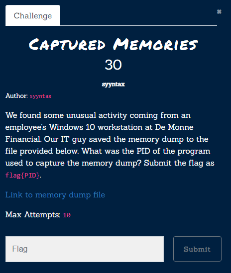
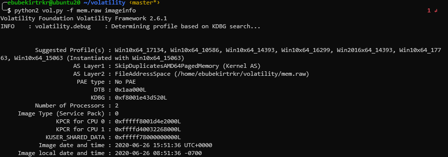

# Captured Memories

[Zip File](../../assets/forensics/mem.raw) 
For the most of the forensics categories in ctf, we use [volatilty](https://github.com/volatilityfoundation/volatility) program and its [cheat sheet ](https://digital-forensics.sans.org/media/volatility-memory-forensics-cheat-sheet.pdf)
Also I use [volatality3](https://github.com/volatilityfoundation/volatility3)
Firstly let's determine  the profile
```bash
	python2 vol.py -f mem.raw imageinfo
```

Lets try out pslist to see if our profile correct. You can understand that profile is incorrect if output malformed I try until get correct profile. Correct profile was `Win10x64_15063`.
```bash
	python2 vol.py -f mem.raw --profile=Win10x64_15063 pslist | tee pslist.txt
```
[plist output](../../assets/forensics/pslist.txt) 
Since nothing from `cmdscan` command I try volatilty3
```bash
	python3 vol.py -f mem.raw windows.cmdline | tee cmdline.txt  
```
[cmdline output](../../assets/forensics/cmdline.txt) 
We can see from last output PID of the program used to capture the memory dump  is `3348` [winpmem](https://winpmem.velocidex.com/)

Flag: `flag{3348}` 