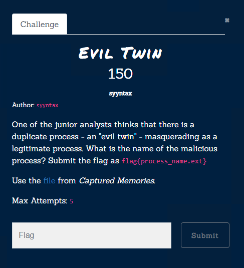
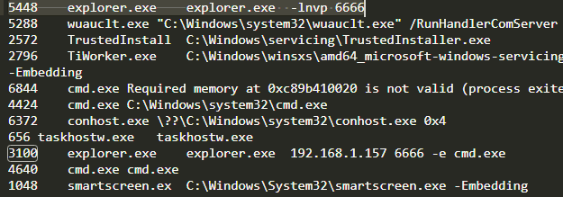

# Evil Twin

[Zip File](../../assets/forensics/mem.raw) 
Please before look to [Captured Memories](Forensics/Captured%20Memories/index.md)
From our [cmdline output](../../assets/forensics/cmdline.txt)  we see that

`explorer.exe` used as netcat and it is twin of real explorer.
Flag: `flag{explorer.exe}` 