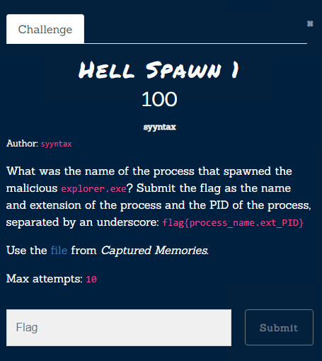

# Hell Spawn 1


[Zip File](https://drive.google.com/file/d/1porBmluAvOp9qaK-lRJf4NqYysfd9gxw/view?usp=sharing) 
Please before look to [Captured Memories](Forensics/Captured%20Memories/index.md)
We need to wind the parent process of  `5448`. 

```bash
	python2  vol.py -f mem.raw --profile=Win10x64_15063 pstree
```
From our [pstree output](../../assets/forensics/pstree.txt)  we can see that parent process is `3944` with the name cmd.exe


Flag: `flag{cmd.exe_3944}` 