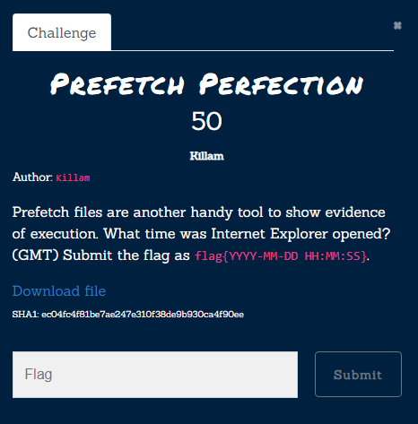
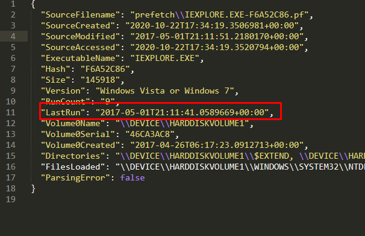

# Prefetch Perfection

[Zip File](../../assets/forensics/prefetch.zip) 
We use [PEcmd](https://github.com/EricZimmerman/PECmd) for Prefetch Explorer
It is enough proces only IEXPLORE related prefetch file which is `IEXPLORE.EXE-F6A52C86.pf`
To process pf file ,nto output folder as json file we use 
```
	PECmd.exe -f "prefetch\IEXPLORE.EXE-F6A52C86.pf" --json output --jsonpretty
```
Then we can easli find lastRun in  [output-file](../../assets/forensics/PECmd_Output.json) 


Flag: `flag{2017-05-01 21:11:41}` 