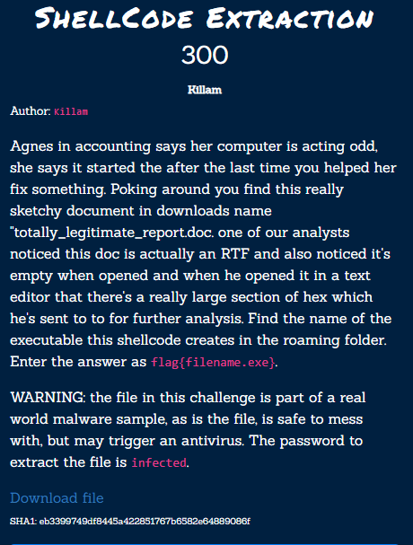
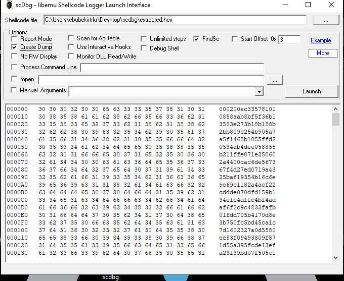
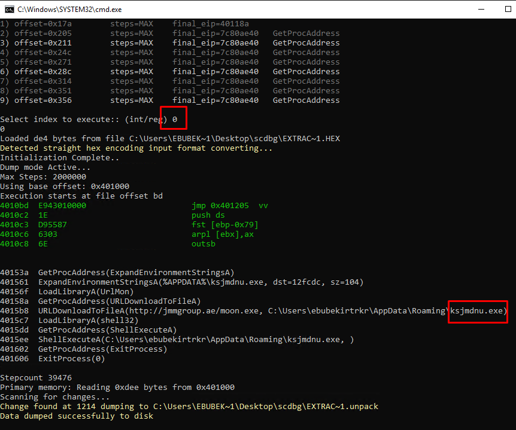

# ShellCode Extraction

[extracted.hex](../../assets/forensics/extracted.hex)

We have hex file from a RTF file. If we search a little bit on google we find program called `scdbg`. It also has a gui.

If we run program followin options

It will produce the asking location

Flag: `flag{ksjmdnu.exe}` 
