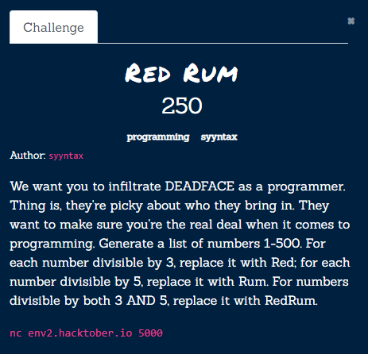
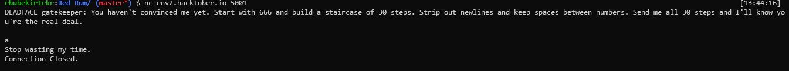
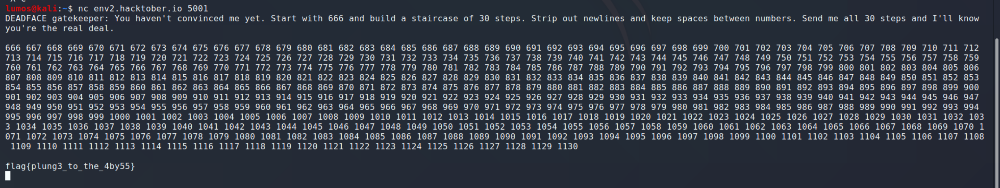

# Stairway to Hell

If we try to connect with
```bash
nc env2.hacktober.io 5001
```
it shows and wants spesific sequence.

I wrote  [solve.py](solve.py) connect with pwntools than send sequence of lines.
```python
from pwn import *
#context.log_level='DEBUG'
conn = remote('env2.hacktober.io',5001)
conn.recvuntil('deal.\n\n')

counter=666
lines=[]
linecounter=1
for i in range(30):
    line=""
    for j in range(linecounter):
        line+=str(counter)+" "
        counter+=1
    lines.append(line)
    linecounter+=1

conn.sendlines(lines)
print(conn.recv())
```


Flag: `flag{plung3_to_the_4by55}` 
