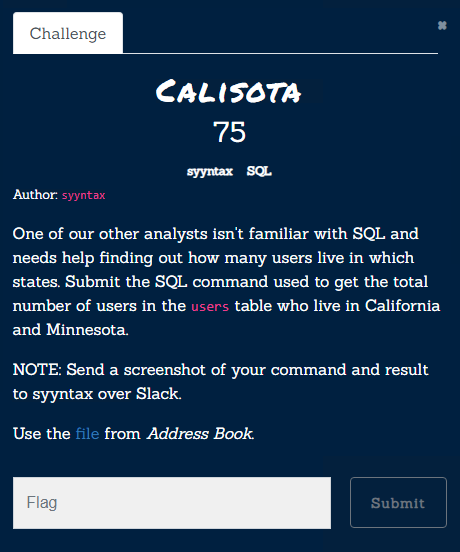
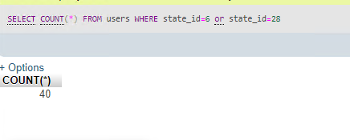

# Calisota

[Zip File](../../assets/sql/shallowgraveu.zip)
`stade_id` of `California` is 6 and `Minnesota` ,s 24
so sql query is
```sql
	SELECT COUNT(*) FROM users WHERE state_id=6 or state_id=28
```

Flag: `SELECT COUNT(*) FROM users WHERE state_id=6 or state_id=28`
