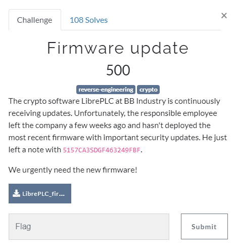
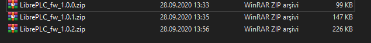
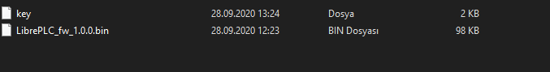
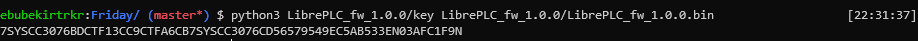
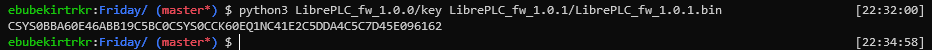
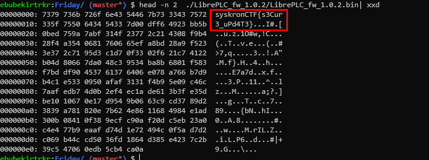

# Firmware update



[attachment file](../../assets/Friday/LibrePLC_firmware_pack.zip)
Note: `5157CA3SDGF463249FBF`

There are 3 files in the given zip file, they are all locked.



First one's flag is the note given `5157CA3SDGF463249FBF`.

First file contains 2 file, `key` is a python script and it requires argument



If we run with
```bash
	python3 LibrePLC_fw_1.0.0/key LibrePLC_fw_1.0.0/LibrePLC_fw_1.0.0.bin 
```
it produces `7SYSCC3076BDCTF13CC9CTFA6CB7SYSCC3076CD56579549EC5AB533EN03AFC1F9N`, which is password of second zip file. 



Second file has one file, so do previous command again with that file
It produces `CSYS0BBA60E46ABB19C5BC0CSYS0CCK60EQ1NC41E2C5DDA4C5C7D45E096162` , which is password of third zip file.



Exracting third zip file, gives one file. If we open it with hex editor, flag is here
```bash
 	head -n 2  ./LibrePLC_fw_1.0.2/LibrePLC_fw_1.0.2.bin| xxd
```



Flag : `syskronCTF{s3Cur3_uPd4T3}`
