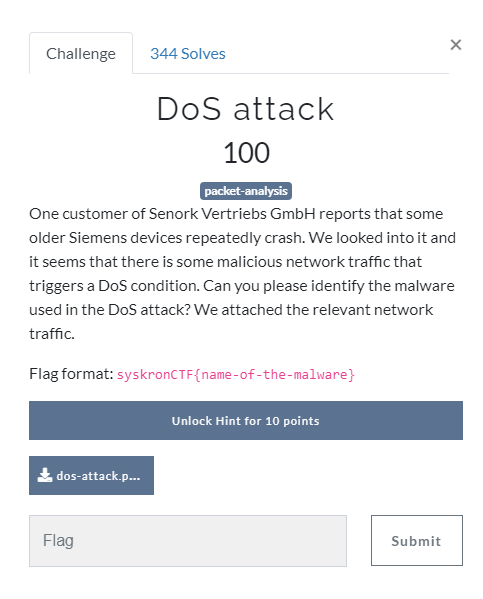

# DoS attack

Chall has [pcap attachment](../../assets/Monday/dos-attack.pcap) 

We take hint for this challenge, hint was `They bought some older SIPROTEC 4 protection relays.`

Search on google `SIPROTEC 4 DoS attack malware` , we find [this wikipedia page](https://en.wikipedia.org/wiki/Industroyer)

Flag : `syskronCTF{Industroyer}`
