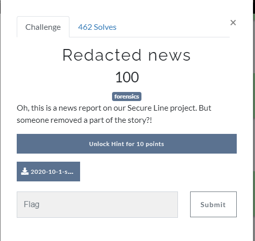
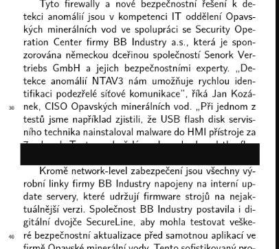
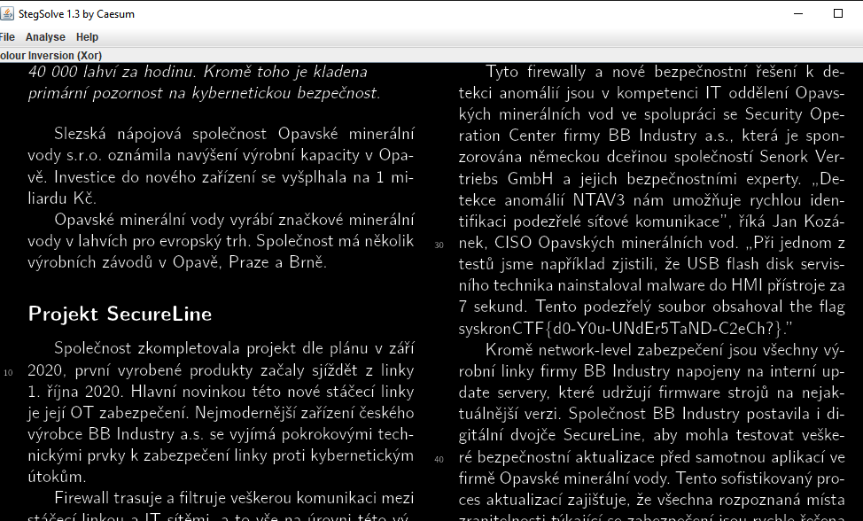

# Redacted news

Chall has a [image attachment](../../assets/Monday/2020-10-1-secureline.png)  and image has a cencored area

If you open  image with [stegsolve.jar](https://github.com/eugenekolo/sec-tools/tree/master/stego/stegsolve/stegsolve) and play with channels a little, you will see the flag

Flag : `syskronCTF{d0-Y0u-UNdEr5TaND-C2eCh?}`
