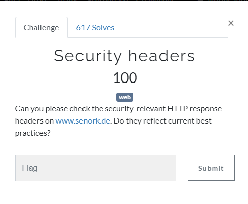
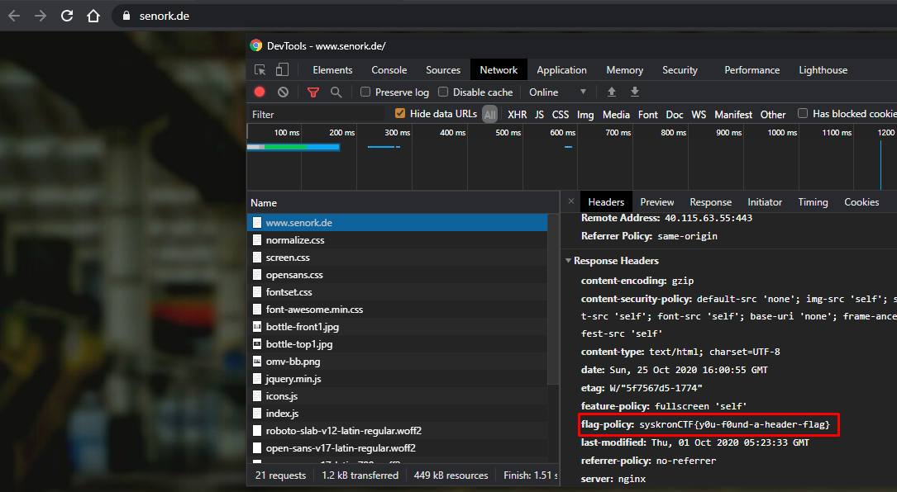

# Security headers

Open chrome devs tools then go to [http://www.senork.de](http://www.senork.de/). If you look at response header you will see flag.

Flag : `syskronCTF{y0u-f0und-a-header-flag}`
