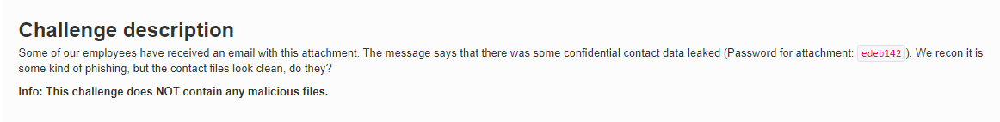
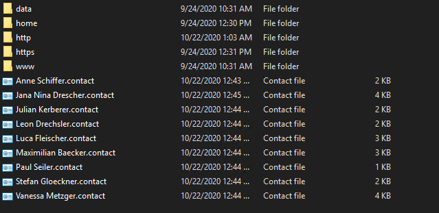
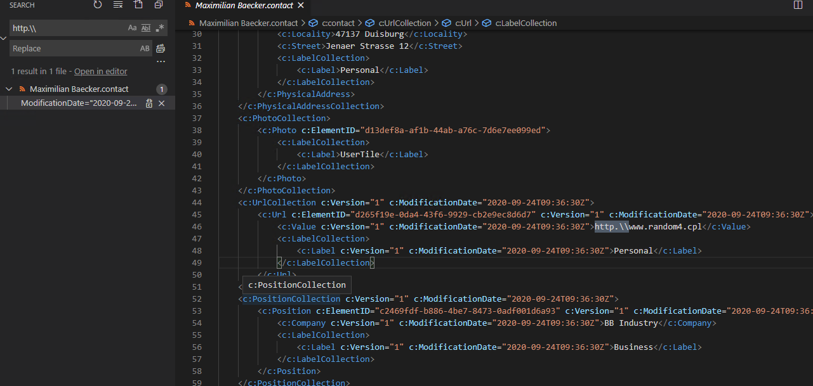
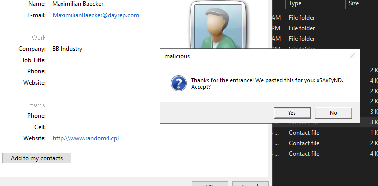
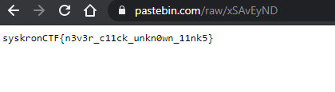

# Contact card

[attachment file](../assets/Thursday/confidential.zip) 
`pass`: `edeb142`

I thought that challenge related to [https://www.hackingarticles.in/exploiting-windows-pc-using-malicious-contact-vcf-file/](https://www.hackingarticles.in/exploiting-windows-pc-using-malicious-contact-vcf-file/), so I search for `http.\\` in the contact files

At `Maximilian Baecker.contact` file it is used and opens `http/www.random4.cpl`.
`www.random4.cpl` is a executable 

so if u look the contact file and click the link popup will occur which is a [pastebin link](https://pastebin.com/raw/xSAvEyND)

Flag : `syskronCTF{n3v3r_c11ck_unkn0wn_11nk5}`
