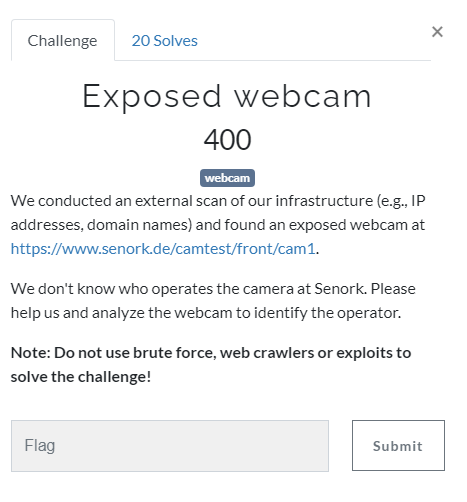
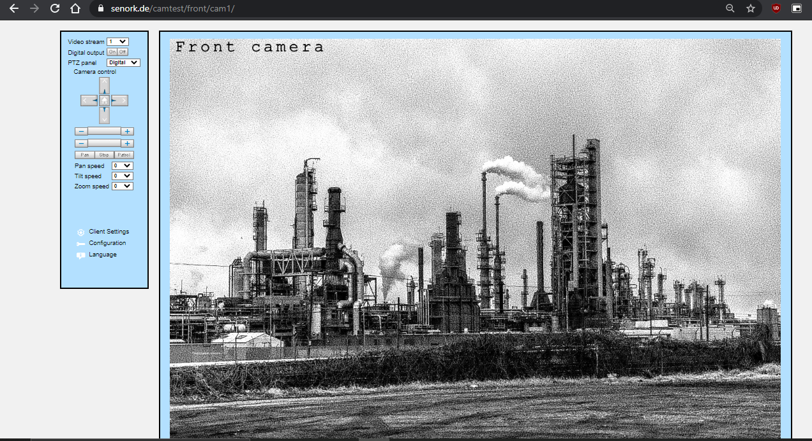
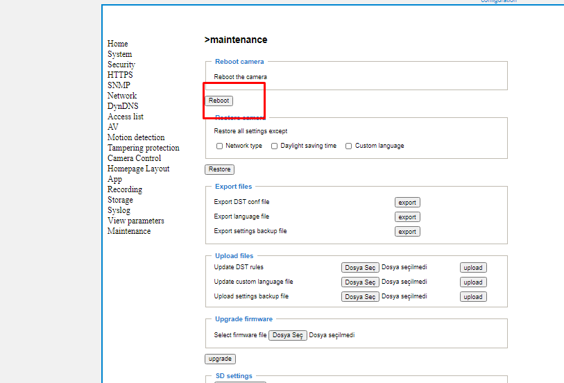
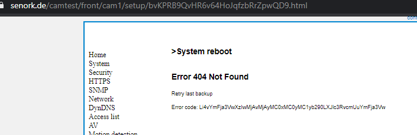
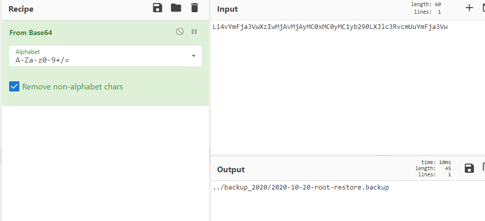
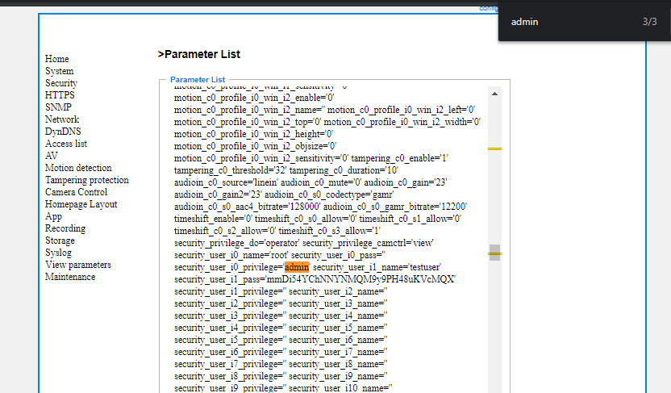
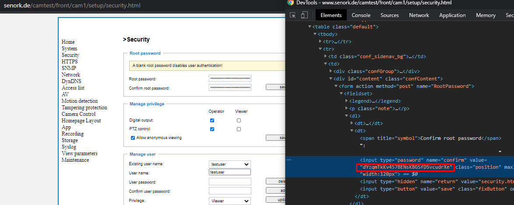

# Exposed webcam

[attachment website](https://www.senork.de/camtest/front/cam1)

There is a cam in 

When we reboot the webcam from `configration->maintenance->reboot`

it redirects to [error page](https://www.senork.de/camtest/front/cam1/setup/bvKPRB9QvHR6v64HoJqfzbRrZpwQD9.html)

which have `Li4vYmFja3VwXzIwMjAvMjAyMC0xMC0yMC1yb290LXJlc3RvcmUuYmFja3Vw` error code. Decode this with [cyberChef recipe](https://gchq.github.io/CyberChef/#recipe=From_Base64('A-Za-z0-9%2B/%3D',true)&input=TGk0dlltRmphM1Z3WHpJd01qQXZNakF5TUMweE1DMHlNQzF5YjI5MExYSmxjM1J2Y21VdVltRmphM1Z3) it produces `../backup_2020/2020-10-20-root-restore.backup`

Download backup file from [this link](https://www.senork.de/camtest/front/cam1/backup_2020/2020-10-20-root-restore.backup) (if not available download from [this](../../assets/Thursday/2020-10-20-root-restore.backup)) It is a locked zip file. We need to find the password.

There is a `testuser`'s' password at `View parameters` page.

 

`mmDi54YChNNYNMQM9y9PH48uKVcMQX` . But it is no the zip file's password.

There is a hidden field at `security` page, and here we go it is zip file's password.

when we exract backup file with the password `dYzqmTkKv457BENsKBGSfD5vcudrXe` , another backup file extracted `testuser.backup` . It is a again zip file with password. Extract it again with previous found password `mmDi54YChNNYNMQM9y9PH48uKVcMQX` and last exracted  file  with named `testuser.backup` is contain flag.

Flag : `syskronCTF{why-1s-th1s-file-here?}`
