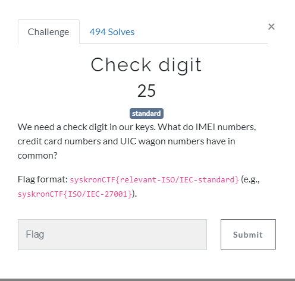

# Check digit

Search on google `IEC standard imei check digit` 

You will end up with [Luhn Algorithm](https://en.wikipedia.org/wiki/Luhn_algorithm)

And find ISO standard

Flag : `syskronCTF{ISO/IEC-7812}`
