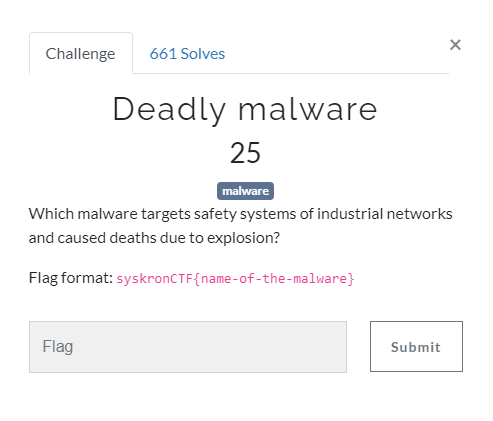
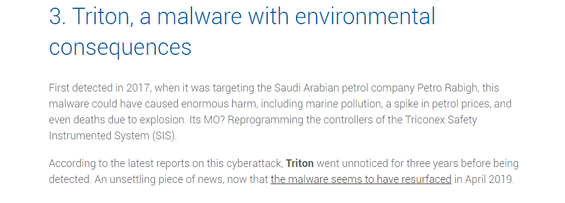

# Deadly Malware

Search on google `malware that caused deaths due to explosion` 

[top-5-most-dangerous-industrial-cyberattacks](https://www.stormshield.com/news/top-5-most-dangerous-industrial-cyberattacks/)

Most suitable malware was `triton`.

Flag : `syskronCTF{triton}`
