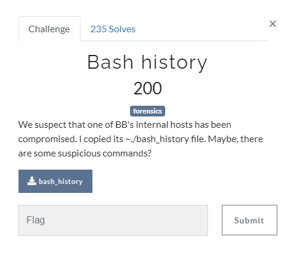

# Bash history

[attachment file](../../assets/Tuesday/bash_history)

if you  open file, you see there are lots of interesting base64 hashes.

I converted all hashes one by using [this  cyberCheff recipe](https://gchq.github.io/CyberChef/#recipe=From_Base64('A-Za-z0-9%2B/%3D',true))

There were 2 interesting hashes. 
`ZWNobyBjM2x6YTNKdmJrTlVSbnQwU0dWNU` will produce  `echo c3lza3JvbkNURnt0SGV5` 
and if you decode `c3lza3JvbkNURnt0SGV5` again , result will be  `syskronCTF{tHey`

Second interesting hash was  `xYTjBNR3hsTFdGc2JDMUVZWFJoSVNGOQ==`. I can't decode this anywhere , at the and I realized that it is the end of the previous hash.
so final hash is `ZWNobyBjM2x6YTNKdmJrTlVSbnQwU0dWNUxYTjBNR3hsTFdGc2JDMUVZWFJoSVNGOQ==`

again decoding resulting hash with base64 produced `echo c3lza3JvbkNURnt0SGV5LXN0MGxlLWFsbC1EYXRhISF9`, then decode `c3lza3JvbkNURnt0SGV5LXN0MGxlLWFsbC1EYXRhISF9`  again to see flag

Flag : `syskronCTF{tHey-st0le-all-Data!!}`
