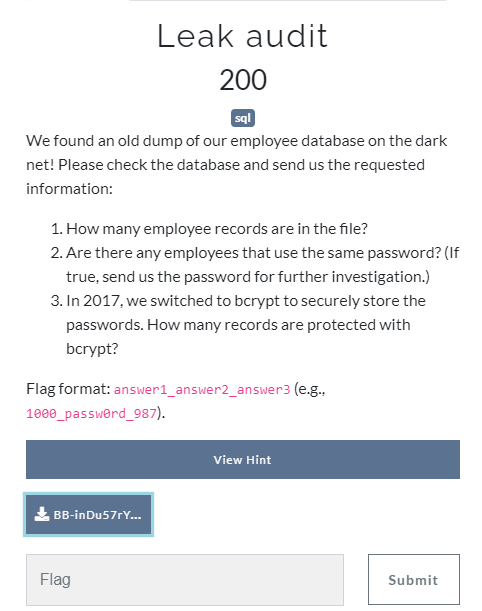
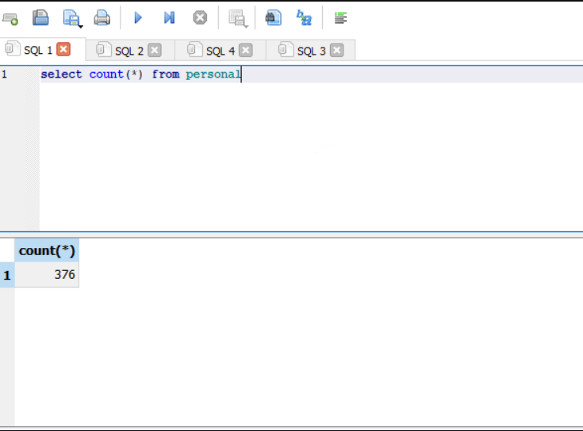
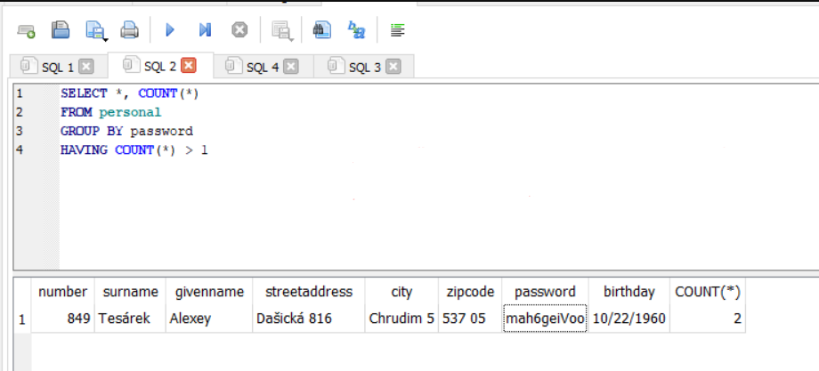
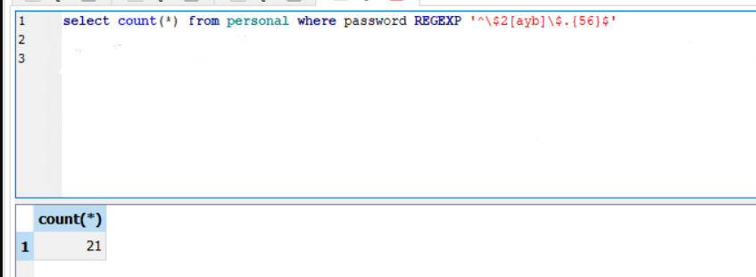

# Leak audit


[attachment file](../../assets/Tuesday/BB-inDu57rY-P0W3R-L34k3r2.tar.gz)

I open the db file with [DB Browser](https://sqlitebrowser.org/).
Then wrote following queries for the each queston.

1) `How many employee records are in the file?`
 ```sql
	 select count(*) from personal
```



2) `Are there any employees that use the same password? (If true, send us the password for further investigation.)`
 ```sql
 	SELECT *, COUNT(*) FROM personal GROUP BY password HAVING COUNT(*) > 1
```



3)`In 2017, we switched to bcrypt to securely store the passwords. How many records are protected with bcrypt?`
```sql
	select count(*) from personal where password REGEXP '^\$2[ayb]\$.{56}$'
```
bcrypt regex from [stackoverflow question](https://stackoverflow.com/questions/31417387/regular-expression-to-find-bcrypt-hash)



Flag : `376_mah6geiVoo_21`
