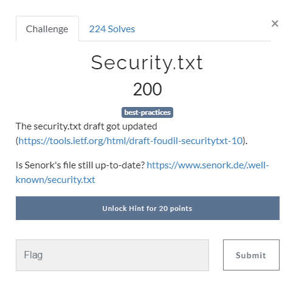
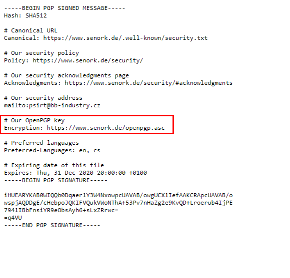
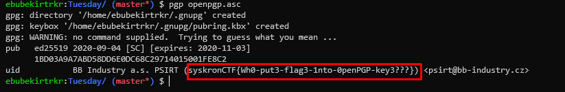

# Security.txt



[https://tools.ietf.org/html/draft-foudil-securitytxt-10](https://tools.ietf.org/html/draft-foudil-securitytxt-10)

[https://www.senork.de/.well-known/security.txt](https://www.senork.de/.well-known/security.txt)
(if txt unreachable [here it is](../../assets/Tuesday/security.txt))



Import [public key](https://www.senork.de/openpgp.asc) (if not reachable [public key](../../assets/Tuesday/openpgp.asc)) with pkg tool to see details 

```bash
	gpk openpgp.asc
```

anddd flag is here.


Flag : `syskronCTF{Wh0-put3-flag3-1nto-0penPGP-key3???}`
