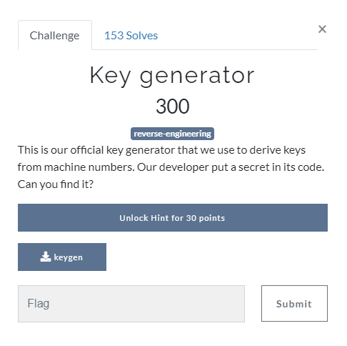
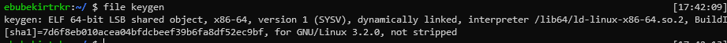
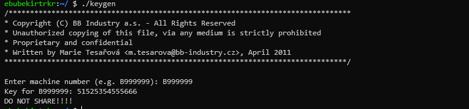
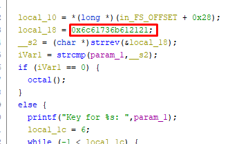
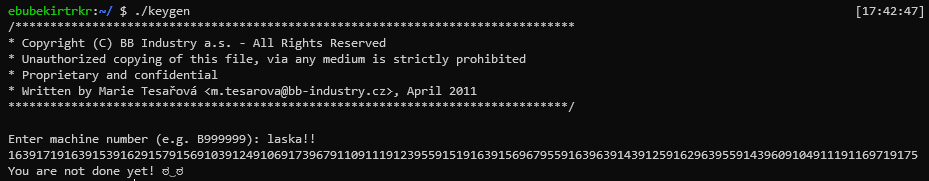
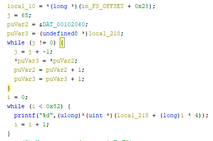
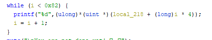
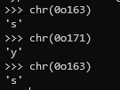
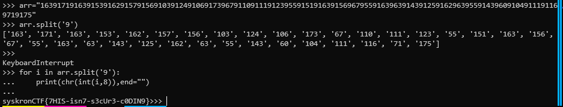

# Key generator



[attachment file](../../assets/Wednesday/keygen)

it is a 64 bit elf file. 



If we run it want to some input and produces Key



Open it with ghidra. at `genserial` function some check for if input is `0x6c61736b612121` or not to call `octal` function.



 if convert hexs to ascii at [cyberCHef](https://gchq.github.io/CyberChef/#recipe=From_Hex('Auto')&input=NmMKNjEKNzMKNmIKNjEKMjEKMjE), you see hidden input is `laska!!`. Then run with `laska!!`
 
 
 
 It produce some big output different than normal ones `1639171916391539162915791569103912491069173967911091119123955915191639156967955916396391439125916296395591439609104911191169719175`
 
 `octal` funtion in ghidra, copy `DAT_00102060` into `local_218`.
 
 
 
 At the second while it print every 4. element of `local_218`
 
 

From the function name I gues output in octal format and also `chr(octal(163))` is `s` and `9`'s are delimeter because there is no '9' in octal format.



I write basic python to convert into octals to char
```python
arr="163917191639153916291579156910391249106917396791109111912395591519163915696795591639639143912591629639559143960910491119116
9719175"

for i in arr.split('9'):
	print(chr(int(i,8)),end="")
print()

```



Flag : `syskronCTF{7HIS-isn7-s3cUr3-c0DIN9}`
