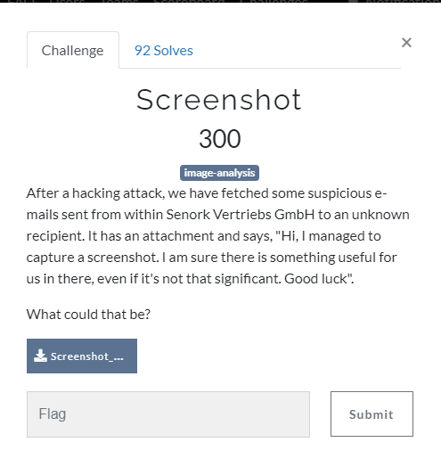
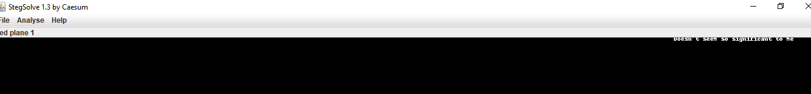
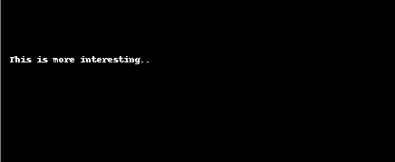
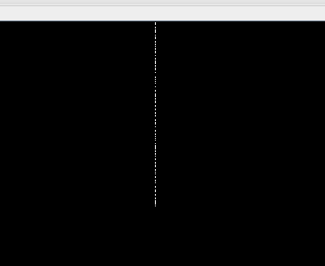
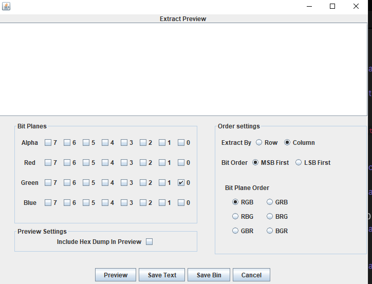
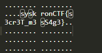

# Screenshot

Chall has a [image attachment](../../assets/Wednesday/Screenshot_2020-05-19_at_11.38.08_AM.png)  

From `even if it's not that significant` statement,  we can understand it is probably LSB related question.

If you open image with [stegsolve.jar](https://github.com/eugenekolo/sec-tools/tree/master/stego/stegsolve/stegsolve) and look around the planes, at red plane 1 you will see message below

and at green plane 0 you will see

 

and  at its upper center

Go to data exract section and exract data with green plane 0 , lsb and column settings checked.

search `s` character in the [output file](../assets/Wednesday/Screenshot_output.txt)  to see flag.

Flag : `syskronCTF{s3cr3T_m3sS4g3}`
